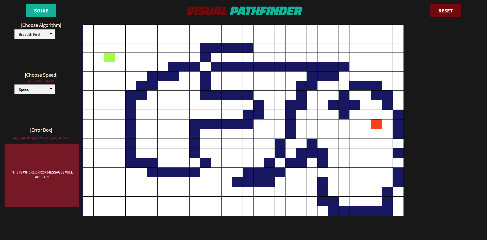
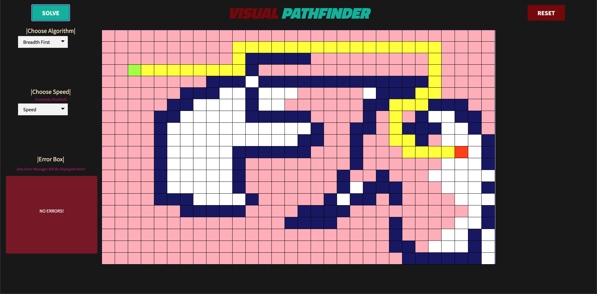

# BFSVisualizer
<h2 align='center'><strong>Breadth First Search Visualizer</strong></h2>
<em>Here is the link to the website --> <a href='https://visual-pathfinder.herokuapp.com/#chart_div_3'>visual-pathfinder.herokuapp.com</a></em> 
 
You have the ability to: 
<ol type="1">
   <li>Visualize how a shortest path is found using BFS.</li>
   <li>Draw your own obstacles for the algorithm to move around.</li>
   <li>Reset the canvas at any time and redo anything.</li>
</ol>
 
This web application utilizes:
<ul type='square'>
   <li>A Flask web server (very lightweight, only deals with url requests) --> <a href='thing.py'>thing.py</a></li>
   <li>Javascript for the BFS Algorithm and the entire interactiveness of the web application --> <a href='static/javascript/main.js'>main.js</a></li>
   <li>HTML & CSS for a simple styling of the website (one page only) --> <a href='templates/pathfinding.html'>pathfinding.html</a></li>
</ul>
 
Screenshots of web application:

